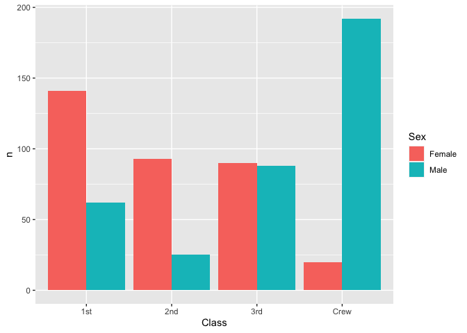
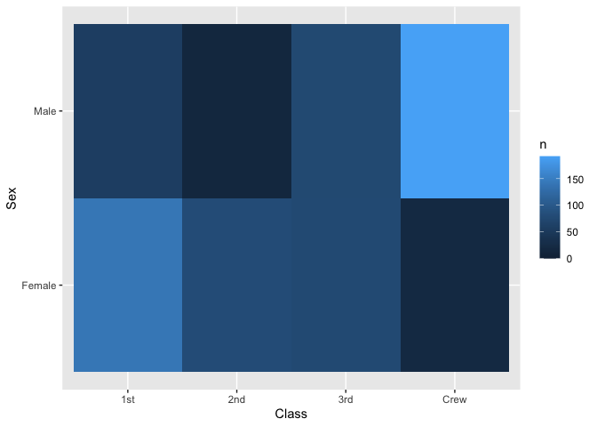
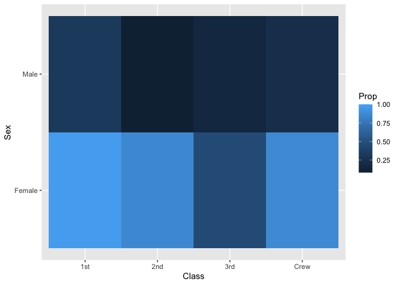
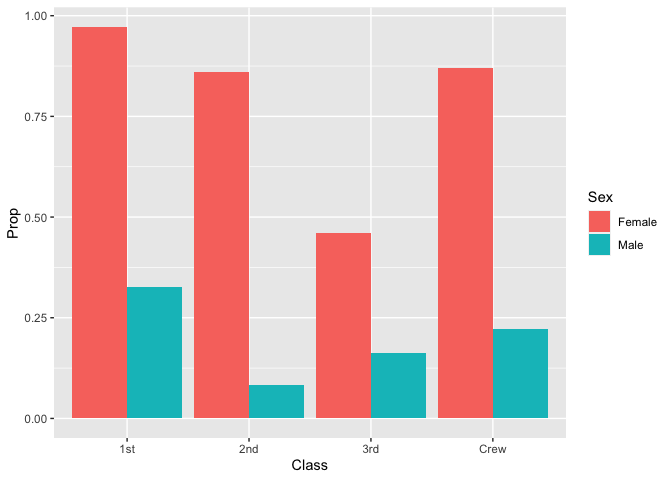
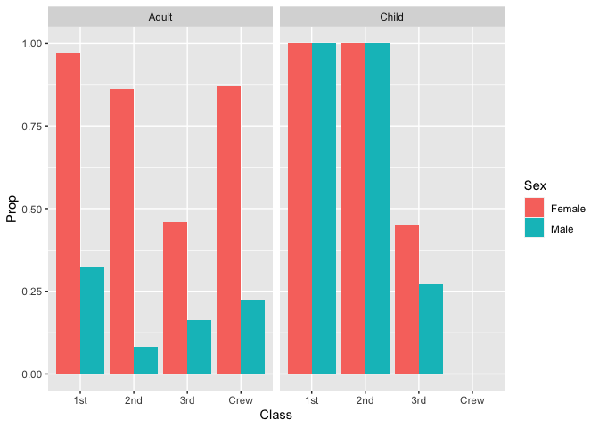

RMS Titanic
================
(Ben Chapman)
2020-07-16

  - [Grading Rubric](#grading-rubric)
      - [Individual](#individual)
      - [Team](#team)
      - [Due Date](#due-date)
  - [First Look](#first-look)
  - [Deeper Look](#deeper-look)
  - [Notes](#notes)

*Purpose*: Most datasets have at least a few variables. Part of our task
in analyzing a dataset is to understand trends as they vary across these
different variables. Unless we’re careful and thorough, we can easily
miss these patterns. In this challenge you’ll analyze a dataset with a
small number of categorical variables and try to find differences among
the groups.

*Reading*: (Optional) [Wikipedia
article](https://en.wikipedia.org/wiki/RMS_Titanic) on the RMS Titanic.

<!-- include-rubric -->

# Grading Rubric

<!-- -------------------------------------------------- -->

Unlike exercises, **challenges will be graded**. The following rubrics
define how you will be graded, both on an individual and team basis.

## Individual

<!-- ------------------------- -->

| Category    | Unsatisfactory                                                                   | Satisfactory                                                               |
| ----------- | -------------------------------------------------------------------------------- | -------------------------------------------------------------------------- |
| Effort      | Some task **q**’s left unattempted                                               | All task **q**’s attempted                                                 |
| Observed    | Did not document observations                                                    | Documented observations based on analysis                                  |
| Supported   | Some observations not supported by analysis                                      | All observations supported by analysis (table, graph, etc.)                |
| Code Styled | Violations of the [style guide](https://style.tidyverse.org/) hinder readability | Code sufficiently close to the [style guide](https://style.tidyverse.org/) |

## Team

<!-- ------------------------- -->

| Category   | Unsatisfactory                                                                                   | Satisfactory                                       |
| ---------- | ------------------------------------------------------------------------------------------------ | -------------------------------------------------- |
| Documented | No team contributions to Wiki                                                                    | Team contributed to Wiki                           |
| Referenced | No team references in Wiki                                                                       | At least one reference in Wiki to member report(s) |
| Relevant   | References unrelated to assertion, or difficult to find related analysis based on reference text | Reference text clearly points to relevant analysis |

## Due Date

<!-- ------------------------- -->

All the deliverables stated in the rubrics above are due on the day of
the class discussion of that exercise. See the
[Syllabus](https://docs.google.com/document/d/1jJTh2DH8nVJd2eyMMoyNGroReo0BKcJrz1eONi3rPSc/edit?usp=sharing)
for more information.

``` r
library(tidyverse)
```

    ## ── Attaching packages ─────────────────────────────────────────────────────────────────────── tidyverse 1.3.0 ──

    ## ✓ ggplot2 3.3.2     ✓ purrr   0.3.4
    ## ✓ tibble  3.0.1     ✓ dplyr   1.0.0
    ## ✓ tidyr   1.1.0     ✓ stringr 1.4.0
    ## ✓ readr   1.3.1     ✓ forcats 0.5.0

    ## ── Conflicts ────────────────────────────────────────────────────────────────────────── tidyverse_conflicts() ──
    ## x dplyr::filter() masks stats::filter()
    ## x dplyr::lag()    masks stats::lag()

``` r
df_titanic <- as_tibble(Titanic)
df_titanic
```

    ## # A tibble: 32 x 5
    ##    Class Sex    Age   Survived     n
    ##    <chr> <chr>  <chr> <chr>    <dbl>
    ##  1 1st   Male   Child No           0
    ##  2 2nd   Male   Child No           0
    ##  3 3rd   Male   Child No          35
    ##  4 Crew  Male   Child No           0
    ##  5 1st   Female Child No           0
    ##  6 2nd   Female Child No           0
    ##  7 3rd   Female Child No          17
    ##  8 Crew  Female Child No           0
    ##  9 1st   Male   Adult No         118
    ## 10 2nd   Male   Adult No         154
    ## # … with 22 more rows

*Background*: The RMS Titanic sank on its maiden voyage in 1912; about
67% of its passengers died.

# First Look

<!-- -------------------------------------------------- -->

**q1** Perform a glimpse of `df_titanic`. What variables are in this
dataset?

``` r
## TASK: Perform a `glimpse` of df_titanic
glimpse(Titanic)
```

    ##  'table' num [1:4, 1:2, 1:2, 1:2] 0 0 35 0 0 0 17 0 118 154 ...
    ##  - attr(*, "dimnames")=List of 4
    ##   ..$ Class   : chr [1:4] "1st" "2nd" "3rd" "Crew"
    ##   ..$ Sex     : chr [1:2] "Male" "Female"
    ##   ..$ Age     : chr [1:2] "Child" "Adult"
    ##   ..$ Survived: chr [1:2] "No" "Yes"

**Observations**:

  - List the variables here Class Sex Age Survived

**q2** Skim the [Wikipedia
article](https://en.wikipedia.org/wiki/RMS_Titanic) on the RMS Titanic,
and look for a total count of passengers. Compare against the total
computed below. Are there any differences? Are those differences large
or small? What might account for those differences?

``` r
## NOTE: No need to edit! We'll cover how to
## do this calculation in a later exercise.
df_titanic %>% summarize(total = sum(n))
```

    ## # A tibble: 1 x 1
    ##   total
    ##   <dbl>
    ## 1  2201

**Observations**:

  - Write your observations here

Wikipedia shows Passengers: 2,435, crew: 892. Total: 3,327 (or 3,547
according to other sources) The dataset includes 2201 observations.
Possibly information was lost about some people.

**q3** Create a plot showing the count of passengers who *did* survive,
along with aesthetics for `Class` and `Sex`. Document your observations
below.

*Note*: There are many ways to do this.

``` r
## TASK: Visualize counts against `Class` and `Sex`
df_titanic %>% 
  filter(Survived == "Yes") %>% 
  count(Sex, Class) %>% 
  #glimpse(.) %>% 
  ggplot()+
  geom_col(mapping = aes(x = Class, y = n, fill = Sex), position = "dodge")
```

    ## Using `n` as weighting variable
    ## ℹ Quiet this message with `wt = n` or count rows with `wt = 1`

<!-- -->

``` r
#df_titanic %>% 
 # filter(Survived == "Yes") %>% 
 # ggplot()+
  #geom_bar(mapping = aes(x = Class, fill = Age))

df_titanic %>% 
  filter(Survived == "Yes") %>% 
  ggplot()+
  geom_tile(mapping = aes(x = Class, y = Sex, fill = n))
```

<!-- -->

**Observations**:

  - Write your observations here

Lots of Male Crew and Female 1st Class survived. Few Female Crew and
Male 2nd class survived.

# Deeper Look

<!-- -------------------------------------------------- -->

Raw counts give us a sense of totals, but they are not as useful for
understanding differences between groups. This is because the
differences we see in counts could be due to either the relative size of
the group OR differences in outcomes for those groups. To make
comparisons between groups, we should also consider *proportions*.\[1\]

The following code computes proportions within each `Class, Sex, Age`
group.

``` r
## NOTE: No need to edit! We'll cover how to
## do this calculation in a later exercise.
df_prop <-
  df_titanic %>%
  group_by(Class, Sex, Age) %>%
  mutate(
    Total = sum(n),
    Prop = n / Total
  ) %>%
  ungroup()
df_prop 
```

    ## # A tibble: 32 x 7
    ##    Class Sex    Age   Survived     n Total    Prop
    ##    <chr> <chr>  <chr> <chr>    <dbl> <dbl>   <dbl>
    ##  1 1st   Male   Child No           0     5   0    
    ##  2 2nd   Male   Child No           0    11   0    
    ##  3 3rd   Male   Child No          35    48   0.729
    ##  4 Crew  Male   Child No           0     0 NaN    
    ##  5 1st   Female Child No           0     1   0    
    ##  6 2nd   Female Child No           0    13   0    
    ##  7 3rd   Female Child No          17    31   0.548
    ##  8 Crew  Female Child No           0     0 NaN    
    ##  9 1st   Male   Adult No         118   175   0.674
    ## 10 2nd   Male   Adult No         154   168   0.917
    ## # … with 22 more rows

**q4** Replicate your visual from q3, but display `Prop` in place of
`n`. Document your observations, and note any new/different observations
you make in comparison with q3.

``` r
df_prop %>% 
  filter(Survived == "Yes") %>% 
  group_by(Class, Sex) %>% 
  ggplot()+
  geom_tile(mapping = aes(x = Class, y = Sex, fill = Prop))
```

<!-- -->

``` r
df_prop %>% 
  filter(Survived == "Yes", Age == "Adult") %>% 
  group_by(Class, Sex) %>% 
  ggplot()+
  geom_col(mapping = aes(x = Class, y = Prop, fill = Sex), position = "dodge")
```

<!-- -->

``` r
df_prop3 <- df_prop %>% 
  group_by(Class, Sex) %>% 
  summarize(Total = sum(n), prop = n/Total )# %>% 
```

    ## `summarise()` regrouping output by 'Class', 'Sex' (override with `.groups` argument)

**Observations**:

  - Write your observations here. I simplified by only plotting adults.
    Female passengers in all classes had a higher proportion that
    survived than Male Passengers. It is surprising that second class
    male passengers were less likely to survive than 3rd class male
    passengers.

**q5** Create a plot showing the group-proportion of passengers who
*did* survive, along with aesthetics for `Class`, `Sex`, *and* `Age`.
Document your observations below.

*Hint*: Don’t forget that you can use `facet_grid` to help consider
additional variables\!

``` r
df_prop %>% 
  filter(Survived == "Yes") %>% 
  group_by(Class, Sex) %>% 
  glimpse(.) %>% 
  ggplot()+
  geom_col(mapping = aes(x = Class, y = Prop, fill = Sex), position = "dodge")+
  facet_grid(~ Age)
```

    ## Rows: 16
    ## Columns: 7
    ## Groups: Class, Sex [8]
    ## $ Class    <chr> "1st", "2nd", "3rd", "Crew", "1st", "2nd", "3rd", "Crew", "1…
    ## $ Sex      <chr> "Male", "Male", "Male", "Male", "Female", "Female", "Female"…
    ## $ Age      <chr> "Child", "Child", "Child", "Child", "Child", "Child", "Child…
    ## $ Survived <chr> "Yes", "Yes", "Yes", "Yes", "Yes", "Yes", "Yes", "Yes", "Yes…
    ## $ n        <dbl> 5, 11, 13, 0, 1, 13, 14, 0, 57, 14, 75, 192, 140, 80, 76, 20
    ## $ Total    <dbl> 5, 11, 48, 0, 1, 13, 31, 0, 175, 168, 462, 862, 144, 93, 165…
    ## $ Prop     <dbl> 1.00000000, 1.00000000, 0.27083333, NaN, 1.00000000, 1.00000…

    ## Warning: Removed 2 rows containing missing values (geom_col).

<!-- -->

**Observations**:

  - Write your observations here.

Children in 1st and second class had 100% survival. Children were more
likely to survive than adults in all classes and all sexes.

# Notes

<!-- -------------------------------------------------- -->

\[1\] This is basically the same idea as [Dimensional
Analysis](https://en.wikipedia.org/wiki/Dimensional_analysis); computing
proportions is akin to non-dimensionalizing a quantity.
